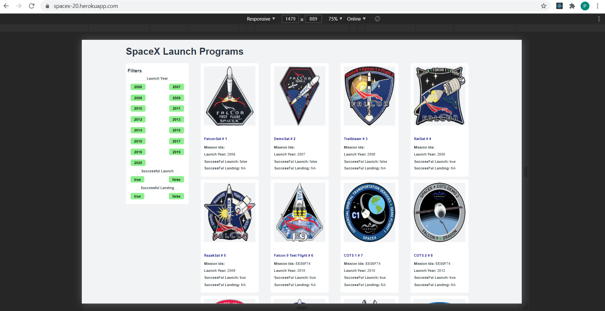

# SpaceX SSR React App ⚛️

## How it looks?

## How it works?

- When there is no filters applied. It will fetch first 100 results(max 100) via spaceX api. It will look like
  

- When you applied filters like year, successful launch or successful landing, then it will fetch first 100 results(100 max) via spaceX api. It will look like
  

**What's included:**

- Server-side rendering with code splitting (via the excellent [React Loadable](https://github.com/thejameskyle/react-loadable) package)
- Server-side data fetching and client-side hydration
- React Helmet for dynamic manipulation of the document `<head />`
- Dev server with hot reloading styles
- Jest and react-testing-library ready to test the crap out of some stuff
- CSS Modules, Sass, and autoprefixer
- Prettier and ESLint run on commit

## Initial setup

- `npm install`

## Development

- `npm start:dev`

  - Start the dev server at [http://localhost:3000](http://localhost:3000) or you can set the PORT.

- `npm test`
  - Start `jest` in watch mode

## Production

- `npm run build && npm run start:prod`
  - Bundle the JS and fire up the Express server for production

## General architecture

This app has two main pieces: the server and the client code.

#### Server (`server/`)

A fairly basic Express application in `server/app.js` handles serving static assets (the generated CSS and JS code in `build/` + anything in `public/` like images and fonts), and sends all other requests to the React application via `server/renderServerSideApp.js`. That function delegates the fetching of server-side data fetching to `server/fetchDataForRender`, and then sends the rendered React application (as a string) injected inside the HTML-ish code in `server/indexHtml.js`.

#### Client (`src/`)

The entrypoint for the client-side code (`src/index.js`) and `src/main.js` to hydrate the React application.

## Deployment

This App is deployed on heroku. [Live Link : https://spacex-20.herokuapp.com/](https://spacex-20.herokuapp.com/)

## Screenshot:

### Lighthouse

### responsive design

#### screen size above 1440px

#### screen size between 1024px and 1440px

#### screen size between 700px and 1024px

#### screen size below 700px

